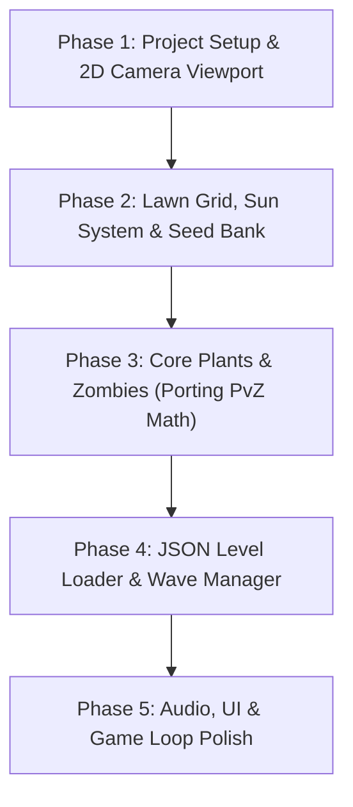

# Plants vs. Zombies Modern Remake - Architecture & Design Document

## Project Vision & Dual Strategy

This project maintains a **Dual Strategy**:
1. **Original Decompiled Engine (`PvZ-Quality-of-the-Lawn-Decompile`)**: Preserved for reference, live fixes, and original formula inspection.
2. **Modern 2D Remake Engine**: A ground-up, clean, data-driven 2D engine built with modern C++ best practices.

---

## Selected Technical Stack

* **Language**: C++17 / C++20
* **2D Framework**: **Raylib / SDL2** (Lightweight, hardware-accelerated 2D rendering, ultra-low memory footprint <10MB executable).
* **Data Format**: **JSON** (Data-driven Plant, Zombie, Card, and Level definitions using nlohmann/json).
* **Viewport & Camera**: Resolution-Independent 2D Virtual Viewport ($1920 \times 1080$ base) supporting native 16:9, 16:10, 21:9 Ultra-wide, and High-DPI displays.
* **Audio System**: Hardware-accelerated multi-channel sound and music stream system.

---

## Architectural Principles

### 1. Component & Entity Architecture
* Monolithic 10,000+ line classes (`Board.cpp`, `Zombie.cpp`, `Plant.cpp`) are replaced by a modular component system:
  * `TransformComponent` (Position, Scale, Rotation)
  * `HealthComponent` (HP, MaxHP, Armor/Shield)
  * `VelocityComponent` (Speed, Direction)
  * `ShooterComponent` (Fire Rate, Projectile Type, Target Detection)
  * `RenderComponent` (Sprite, Animation Frame, Color Tint)

### 2. Data-Driven Gameplay
* All Plant and Zombie statistics (Sun cost, HP, DPS, attack range, movement speed, collision boxes) are defined in external `.json` configuration files.
* Levels, waves, background environments, and zombie spawns are scriptable via JSON files without recompiling code.

### 3. Native 2D Viewport
* Eliminates hardcoded pixel offsets and legacy `(BOARD_OFFSET - 220)` math.
* Game logic operates in normalized world coordinates; the Camera System automatically projects world coordinates to any screen resolution.

---

## Execution Roadmap

### Phase 1: Engine Foundation & Viewport
- Set up C++ build setup with Raylib/SDL2.
- Implement $1920 \times 1080$ Virtual Viewport Camera with aspect-ratio scaling.
- Build asset loader for PNG sprites and JSON configurations.

### Phase 2: Lawn Grid & Interaction
- Build $9 \times 5$ interactive Lawn Grid with mouse/touch hit testing.
- Implement Sun spawn, movement, bounce physics, and collection logic.
- Implement Seed Bank UI bar with card selection, cooldown timers, and planting triggers.

### Phase 3: Plant & Zombie Mechanics
- Implement core plants: Peashooter, Sunflower, Wall-nut, Cherry Bomb.
- Implement core zombies: Normal, Conehead, Buckethead.
- Port original damage, collision box, and projectile mechanics directly from original C++ formulas.

### Phase 4: Wave Management & Level Loader
- Implement JSON Level script parser (`level_1_1.json`).
- Build Wave Manager with progress bar, wave triggers, and flag zombie spawns.
- Implement Game State Machine (Main Menu, Level Intro, Playing, Paused, Level Complete, Game Over).
